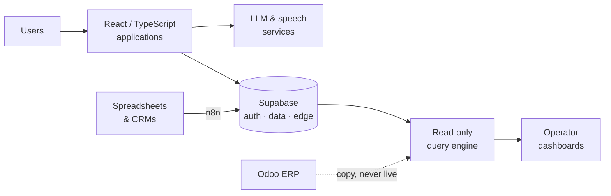

 

I build AI products end to end — TypeScript and React on the surface, Python data engines and Supabase behind them — and the automation that keeps them fed.

Roughly three quarters of my work is application code: AI platforms, voice interfaces, internal tools. The rest is the data layer those products depend on. Based in Egypt. Most of my day-to-day work lives in private client repositories, so what is public here is a representative slice rather than the whole picture.

 

---

## What I work on

<b>AI products</b> — voice interfaces, conversational apps, LLM-backed tooling

 

The largest share of my work. Full-stack TypeScript applications with language models and speech at the core: live AI interview practice that adapts its questions to a candidate's CV and returns a scored report, voice conversation interfaces, resume scoring, and a B2B AI platform.

Typically React and Vite on the front, Supabase for auth, storage and Edge Functions, with OpenAI and ElevenLabs behind them. The engineering problem is rarely the model call — it is state, latency, cost, and giving the user something trustworthy when the model is wrong.

<b>Data systems &amp; analytics</b> — query engines and dashboards for operators

 

A read-only HTTP query engine over an Odoo ERP database. Dashboards send a structured request — *total sales per salesperson last month* — and the engine composes it with SQLAlchemy against a copy of the database, never accepting SQL from the caller. Every connection opens with `default_transaction_read_only = on`, so PostgreSQL itself refuses a write.

On top of it sit dashboards built for the person making the decision rather than for an analyst: frozen capital split into truly dead versus seasonally dormant stock, margin leakage, what to buy and what to liquidate, salesperson performance, seasonality.

<b>Internal tools &amp; automation</b> — the unglamorous layer that makes the rest work

 

Spreadsheet importers that let anyone map arbitrary column layouts onto CRM fields and show which rows will actually store before anything is sent. Validators, webhook tooling, and n8n pipelines connecting CRMs, sheets, and internal services.

This work replaces one-off hardcoded migrations with something a non-engineer can run twice.

---

## How the pieces fit

---

## Engineering activity

I work in pull requests even on solo projects: **64 of the 65 I have opened are merged**, each one a scoped change with a version tag, reviewed before it lands. A representative run from one analytics product — `feat(products): global filters and quantity-first KPIs`, then `perf: 120-day window and 20-minute refresh`, then `perf: precompute day buckets, one-pass velocity` after a release measured slow.

Public repositories here are mostly work in progress. The finished systems live in private client repositories.

---

**[ahmed.gomaa.adnan@gmail.com](mailto:ahmed.gomaa.adnan@gmail.com)**

Open to roles and projects in applied AI, full-stack product engineering, and data.

