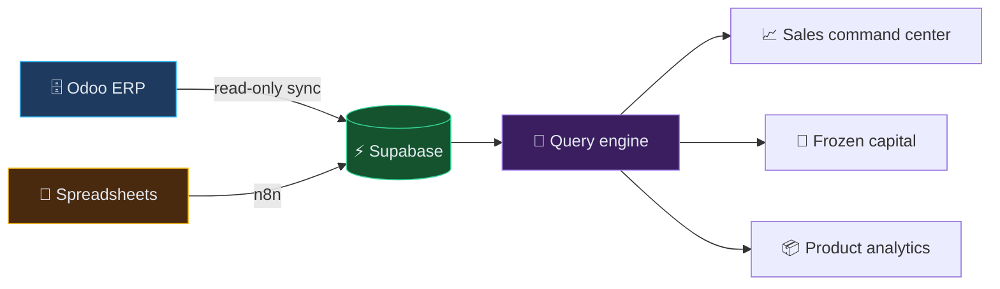

 

---

I turn messy ERP exports and spreadsheets into dashboards people actually make decisions with — and build AI products around them.

Based in Egypt. Most of my day-to-day work lives in private client repositories, so what's public here is a representative slice rather than the whole picture.

---

### How the work usually flows

Production ERP stays untouched. Everything downstream reads from a copy.

---

### What I do &nbsp;<i>click to open</i>

<b>🗄️ &nbsp;ERP &amp; data pipelines</b>

 

Read-only query engines over Odoo databases, synced into Supabase, so reporting and dashboards never touch a live ERP. The engine speaks Odoo-shaped queries, so dashboards ask questions in the language the business already uses.

<b>📊 &nbsp;Analytics dashboards for operators</b>

 

Built for the person making the call, not for analysts. Frozen capital split into *truly dead* vs *seasonally dormant* stock, aging buckets, per-brand and per-category breakdowns, salesperson performance, and seasonality heatmaps that answer one question: **what do I clear, and when?**

<b>🎙️ &nbsp;AI voice &amp; conversational products</b>

 

Live AI interview practice with CV-aware questions, text-to-speech, and scored feedback reports — so every session is measurably better than the last. Built on OpenAI and ElevenLabs, shipped on Supabase Edge Functions.

<b>🔗 &nbsp;Workflow automation</b>

 

n8n pipelines connecting CRMs, spreadsheets, and internal tools — column mapping, validation before storage, and no manual re-entry.

---

### Selected public work

<table>
<tr>
<td width="50%" valign="top">

#### 🧊 [Frozen Capital Dashboard](https://github.com/Gomaa1a/dabboos-frozen-capital)

Splits a distributor's stuck inventory into **truly dead** and **seasonally dormant** capital. Aging buckets, a live idle-threshold slider, and a monthly heatmap flagging what to clear now.

`Bilingual AR/EN` `JavaScript`

</td>
<td width="50%" valign="top">

#### 📈 [Retail Analytics Dashboard](https://github.com/Gomaa1a/E-commerce-Use-case-Data-Analytics-Dashboard-)

A full year of beverage retail sales analysed from raw Excel — net profit, growth trends, best and worst products, salesperson performance.

`Python` `pandas` `Chart.js`

</td>
</tr>
<tr>
<td width="50%" valign="top">

#### 🎙️ [HireReady](https://github.com/Gomaa1a/HireReady)

An AI voice interview coach. Runs a live interview tailored to your CV, then returns an honest, scored performance report.

`React` `Supabase` `OpenAI` `ElevenLabs`

</td>
<td width="50%" valign="top">

#### ⚖️ [Law Firm SaaS](https://github.com/Gomaa1a/LawFirm-SAAS-Model)

A demo SaaS model built for law firms.

`TypeScript` `React`

</td>
</tr>
</table>

---

### Get in touch

**[ahmed.gomaa.adnan@gmail.com](mailto:ahmed.gomaa.adnan@gmail.com)**

Open to roles and projects in data engineering, analytics, and applied AI.

